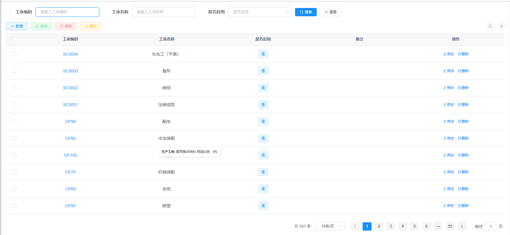
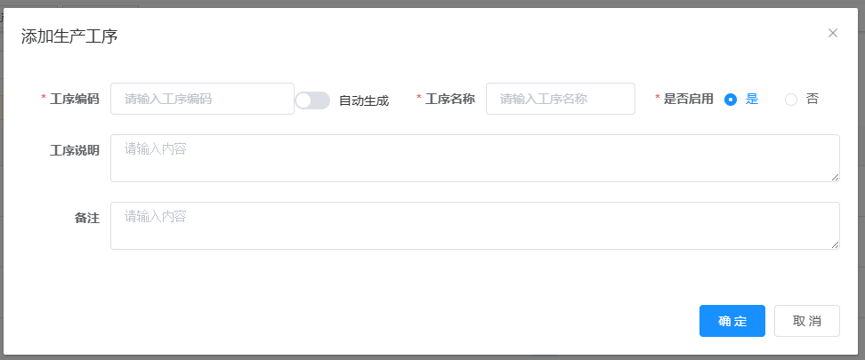
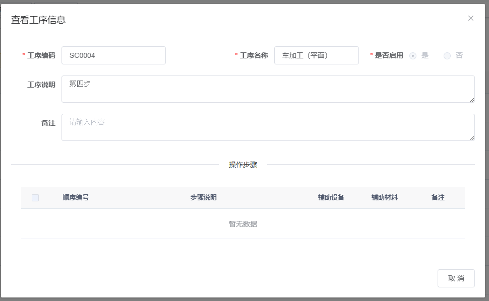
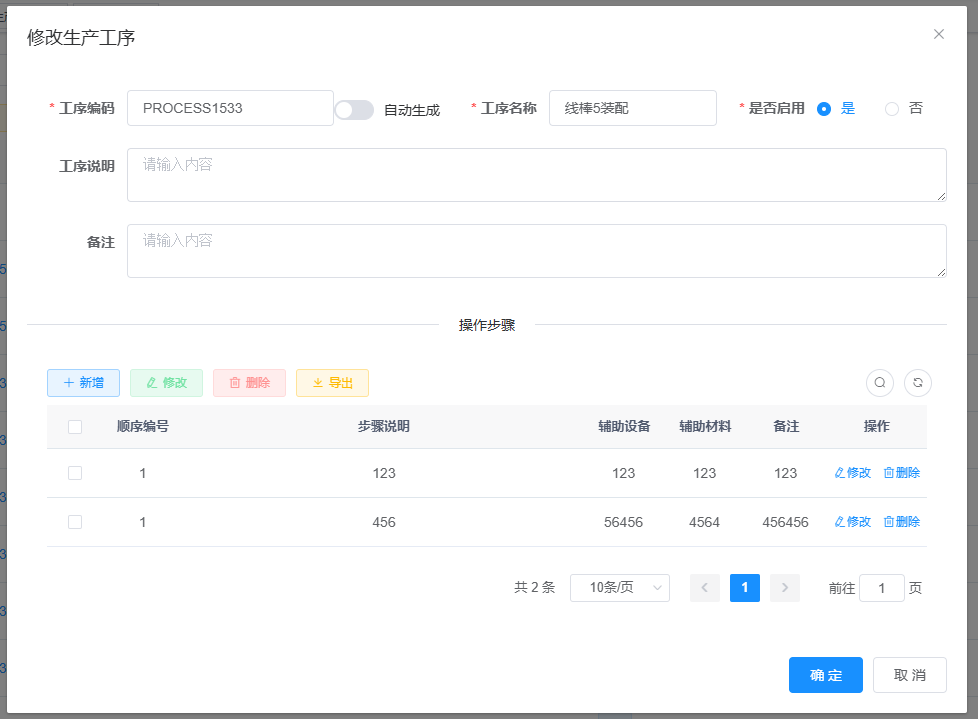
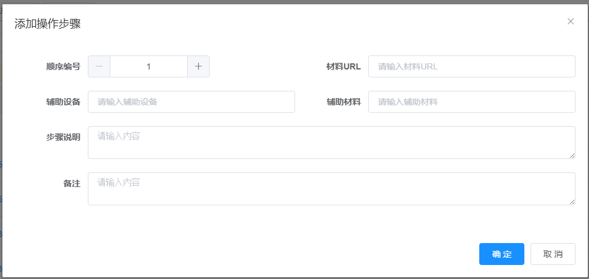
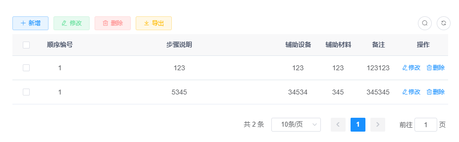
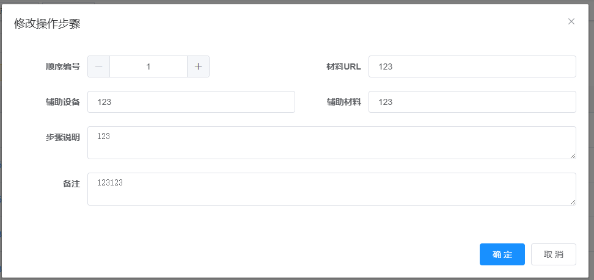

## 1.客户管理

## 2. 工序管理

### 2.1 多条件分页查询工序

查询条件：工序编码，工序名称，是否启用，页码，每页大小

显示内容：工序编码，工序名称，是否启用，备注，操作（修改，删除）

 

### 2.2新增工序

新增内容：工序编码（可以自动生成）、工序名称、是否启用、工序说明、备注

 

### 2.3 查看工序详情

显示工序详情，同事显示工序操作步骤（不可编辑）

 

### 2.4 修改工序

显示修改表单，工序编码不可修改，可以对工序的操作步骤进行CRUD操作

 

### 2.5删除工序

根据工序编号删除工序。

### 2.6 新增工序步骤

新增字段：顺序编号，材料URL，辅助设备，辅助材料，步骤说明，备注

 

### 2.7根据工序编号分页查询工序步骤

 

### 2.8 编辑工序步骤

 

### 2.9 删除工序步骤

工具工序步骤编号删除工序步骤