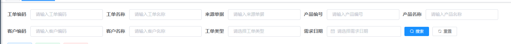
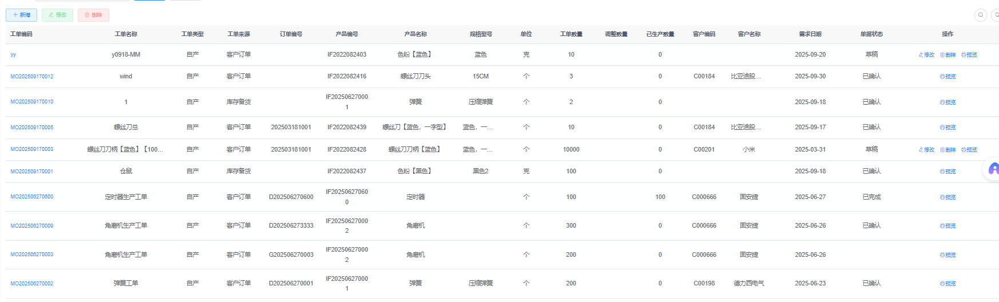
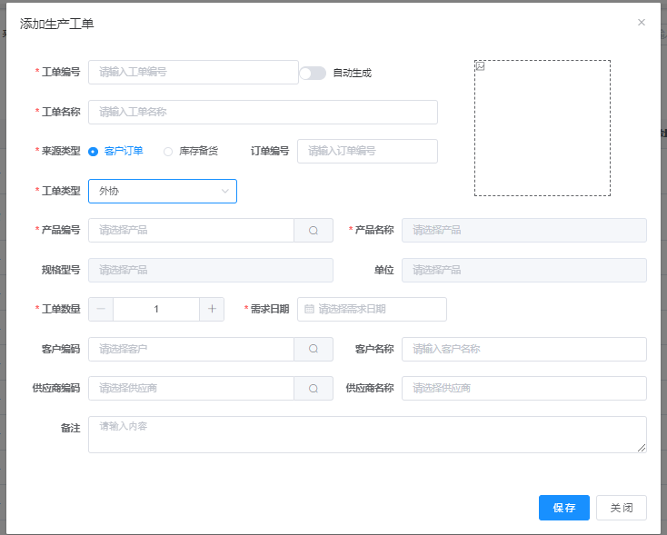
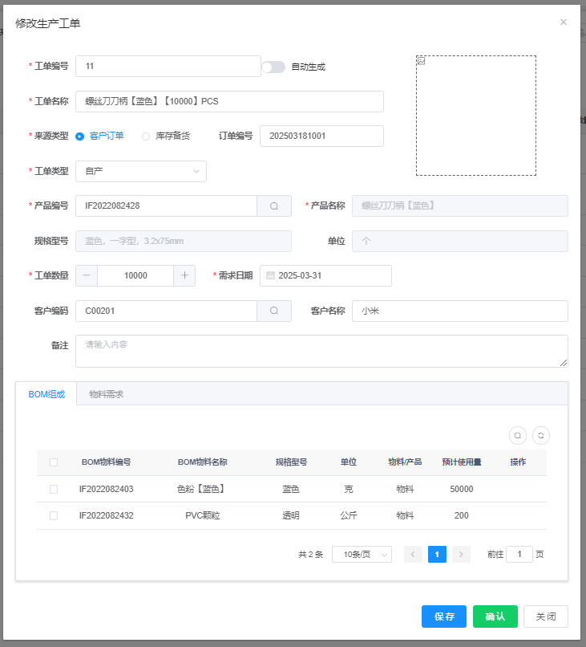
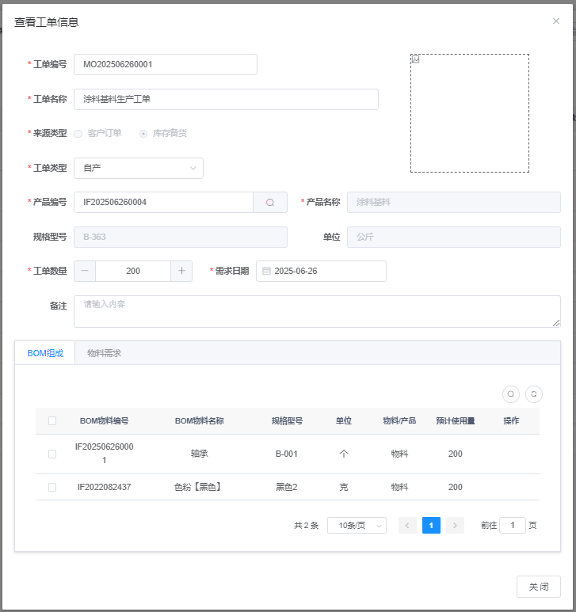

### 功能1：多条件分页查询工单列表

查询条件：

 

展示的数据：

 

说明：

> 工单不同的状态要展示不同的菜单。
>
> 工单状态必须是来自字典表。需要新增工单的状态字典。
>
> 工单状态包括：
>
> 1. 草稿：刚刚新建的，还没有确认。  草稿状态下的工单有如下操作按钮：  修改、删除、预览
> 2. 已确认：已经确认工单内容，等待审核。   已确认状态的工单有如下操作按钮：  审核、预览
> 3. 已审核：已审核状态的工单说明审核通过，审核通过的工单有如下操作按钮： 预览  审核未通过的工单将重新回到草稿状态。

### 功能2：新增工单

 

说明：

> 来源类型如果选择了客户端订单，则必须填写订单编号和客户编号。
>
> 工单类型如果是   外协或者外购  则必须填写供应商编号。
>
> 工单类型如果是自产则  无需填写供应商编号。

### 功能3：根据工单编号查询工单信息，并且回显编辑，编辑之后提交保存

 

说明： 

> 编辑弹窗中需要显示这个工单生产产品的BOM组成。（要考虑产品的BOM组成设计）
>
> 编辑弹窗中有保存和确认两个按钮，保存按钮只是保存编辑的结果。  确认按钮的作用是将工单修改为确认状态。

### 功能4：工单详情

 

说明：和编辑弹窗内容一致，只是不能编辑

### 功能5：根据工单编号删除工单

草稿状态的工单可以直接删除

